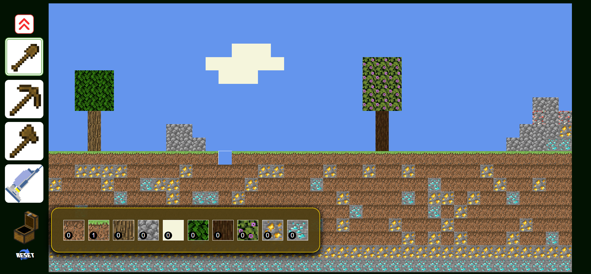
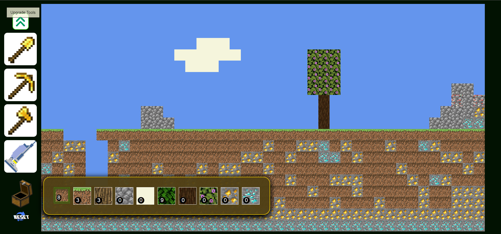

# 🐱‍👤 MineCraft - Weekend assignment
I was given a task @AppleSeeds Bootcamp to make a small MineCraft game while only using ```JavaScript```, ```HTML``` & ```CSS``` 

The basic task was to make a game with the specifications given in writing and a video.

<br />

### My design was simple and I made sure to include:


#### Small tutorial
A landing page with a start button and insturctions

#### All basic rules set in place
The player can pick up Tiles by using the tools and place them back to the world


#### Styling same close to origin
I was trying to make the basic game look almost the same as the original game from the specs

<a href="gameSpecs.pdf" target="_blank">Instructions-PDF</a>

<br>

#### Features
I decided to add some extra stuff for fun like upgrading weapons and giving tier to the tiles

#### App responsiveness
I made sure that the app is useable for smaller screens as well in landscape mode.

<br />


## Demo site link

https://elad-minecraft2d.netlify.app/


<br />


## Screenshots

 

 

 


## Deployment

To deploy this project run

```bash
  ./index.html
```
This is a basic site with only one page of ```HTML``` , ```JavaScript``` and ```CSS``` styling
